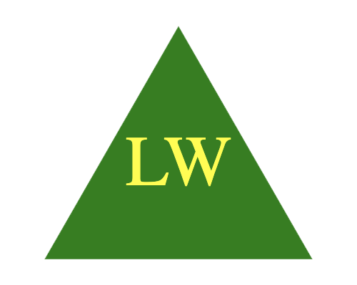

# svg-logo-maker
Bootcamp Homework 8: SVG Logo Maker

## Object-Oriented Programming Challenge: SVG Logo Maker
In this project, we were asked to build an SVG Logo Maker where a user answers a series of questions that will then render in the file that is auto generated by this app. The main task is to create a command-line application that dynamically generates a logo file in SVG format from a user's input using the Inquirer package. In my application, the auto generated logo/SVG file will be created in the root directory. 

## How to Use this App:
To run the application, the steps are:
1. Run node index.js in your terminal
2. Answer all 4 questions
3. The logo.svg file will be generated

## References/Resources
I mostly referred to our recent lessons/activities for this assignment. 

For the shapes, I used MDN Web Docs (https://developer.mozilla.org/en-US/docs/Web/API/Canvas_API/Tutorial/Drawing_shapes) and W3 schools:

* Circle: https://www.w3schools.com/graphics/svg_circle.asp

* Square: https://www.w3schools.com/graphics/svg_rect.asp

* Triangle: https://www.w3schools.com/graphics/svg_polygon.asp 

For NPM Packages:

* Inquirer: https://www.npmjs.com/package/inquirer/v/8.2.4

* File System: https://nodejs.org/docs/latest-v18.x/api/fs.html 

## URLs submitted
* My Repo URL: https://github.com/lenzlee/svg-logo-maker
* Application URL: https://lenzlee.github.io/svg-logo-maker/
* Video Demo: 

## My Application Screenshots

## Link to Demo Video